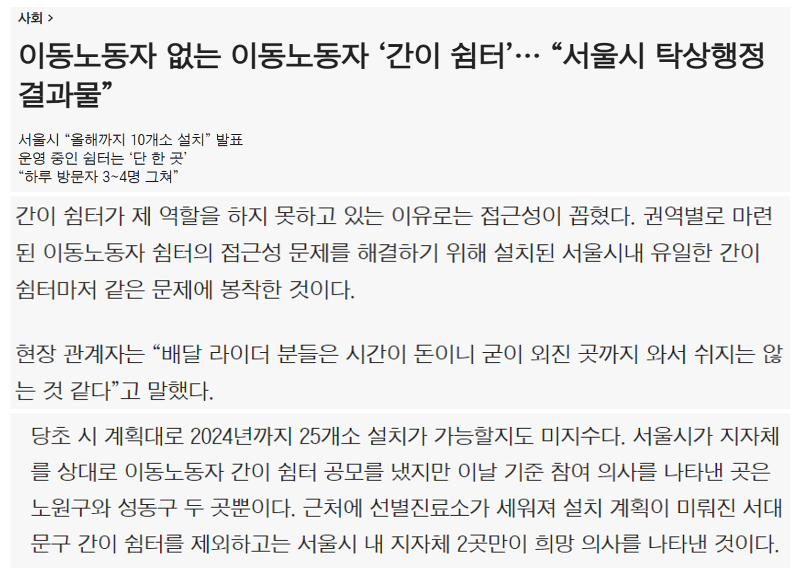
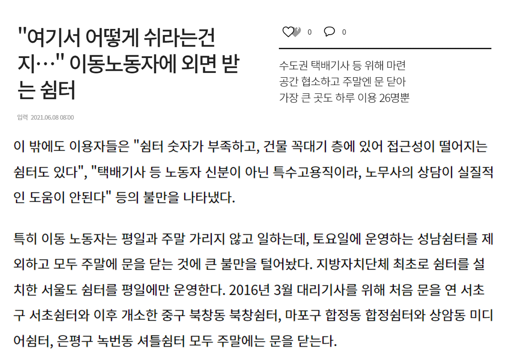
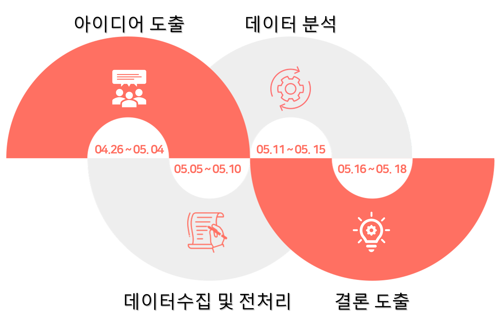

## 이동노동자 쉼터 위치 추천

### 개요
파이썬을 이용한 서울지역 이동노동자 쉼터 위치 추천

### 기술스택
</a>

### 수행배경
- 이동노동자 쉼터의 열약한 점(접근의 어려움, 공간의 협소함, 주차 공간 미비 등)을 파악했습니다.
- 개선 방법으로 이동노동자 쉼터 위치를 보다 적절한 곳에 설치할 수 있도록 추천을 목표로 했습니다.

### 진행일정

### 수행과정
- 2022.05.09. 기준 진행중입니다.

### 분석결과
- 2022.05.09. 기준 진행중입니다.

### 후기
- 2022.05.09. 기준 진행중입니다.
